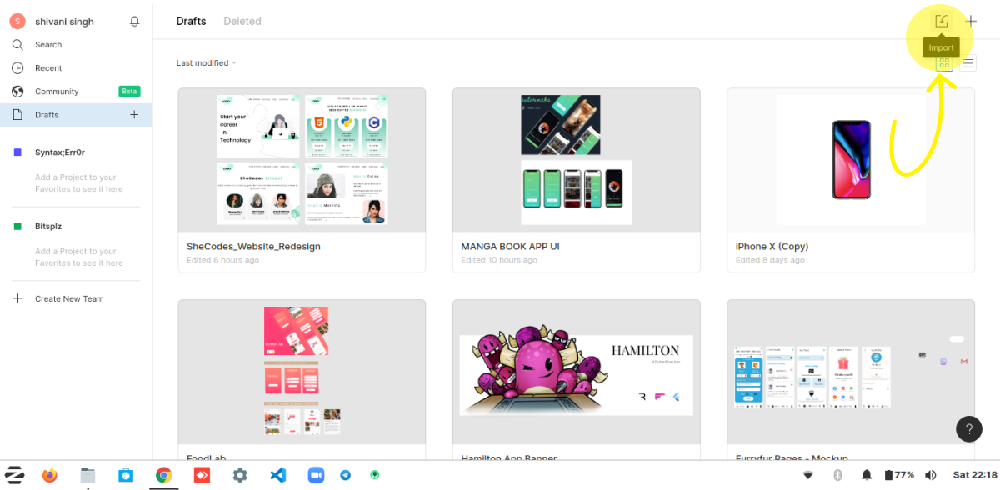

<p align="center">
  <a href="https://github.com/Singh-Shivani/Sutoribukku"> 
     
    </a>
</p>
<p align ="center"> 
   <i> A Manga App UI Design 🖤 </i>
</p>

### SCREENS 📱
<p align="center">
      
  
</p>
<p align="center">
      
  
</p>
<p align="center">
  
      
</p>


### HOW TO USE IT? 🧐

- Prerequisite- If you want to see core of the design then open an acount on  <a href="https://www.figma.com/"> Figma.</a> ✌️
  1. Download the ```MANGA APP UI.fig```  file from the repository located in branch ```master```

       <p align="center">
            
       </p>

   2. Click on "IMPORT" button as shown in the above image. Choose the file you've saved and you're done!🥳

   3. Manipulate and customize the design in your way! 
   
   
   
### ON FIGMA 🔗
- Click here to see the design on figma   
<a href="https://www.figma.com/file/pDhKEL362291fgUVtINiu2/MANGA-BOOK-APP-UI?node-id=0%3A1">Manga App UI Design ⚡</a>
